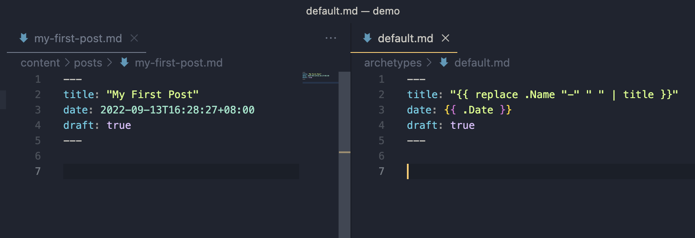
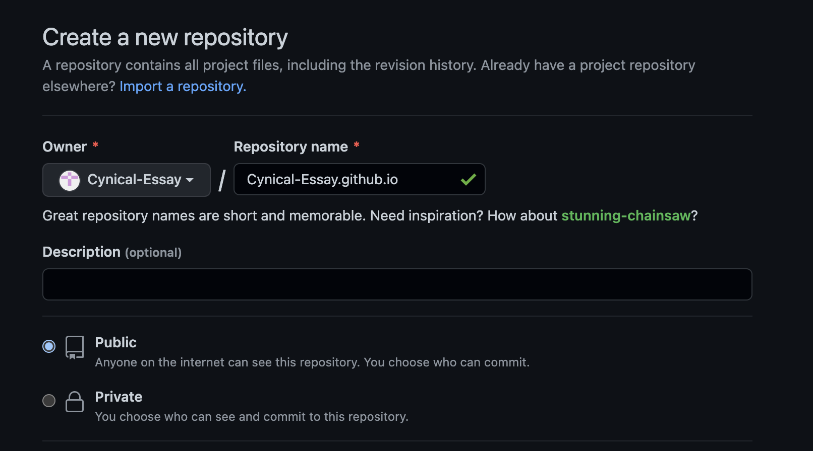

## 前言 ##

透過部落格學習新技術與紀錄生活，一直是個不錯的選擇。  

兩三年前雖然也嘗試以 Blogger 來撰寫部落格，不過實在太~~懶惰~~忙碌了，最終還是扔在那裡長草了。

最近剛好趁專案的空檔，想來一雪前恥，結果發現除了過往使用如 Blogger / Medium / WP 等部落格平台服務外，其實也可以選擇透過靜態網站生成框架來撰寫部落格。對於有著烏鴉性格的軟體工程師而言，
這種**閃亮亮** + **有趣** 兼具 **炫砲** 的玩意，總是特別的吸睛啊。

於是有點遞迴的，這個不太正經的部落格的誕生，就是從一篇如何透過 Hugo 靜態網站生成框架來架設本部落格的文章作為起點。

## 萬丈高樓本機起 ##

### Hugo 簡介 ###

根據 [官網](https://gohugo.io/) 描述，Hugo 是一個靜態網站生成器 (Static Site Generator) 的框架。  

直白點說，就是配合其規則，把想要的內容，用 **指定的語法** 撰寫後，放到 **指定的檔案路徑** 下，透過如 CLI 指令即可產生靜態網站的產出物，至於如路由之類的底層操作則交由框架來負責，使用者就不用費心了。

靜態網頁生成器框架種類其實挺不少的，無論是以 Node.js 開發的 **Hexo**，或是以 Gloang 開發的 **Hugo** 等，生態圈都相當完整，使用者也都不少。
之所以會選擇 Hugo，單純只是覺得對於一個架設部落格的新手而言，與其花大量時間在研究這些差不多優秀的框架的細節，還不如就直接擇一開始研究與實作，~~何況身為一個軟體工程師，應該可能八成大概也沒有什麼事情是解決不了的吧。~~  

> 樂觀主義是民族的鴉片  
>
> -米蘭．昆德拉《玩笑》
{.common-quote-class}

### 環境安裝 ###

MacOS 作業系統的使用者，配合 Homebrew 套件管理工具，安裝上就跟大多數套件的安裝大同小異。

```
brew install hugo
```

一行，打完收工。

然後也跟大多數套件的安裝一樣，來確認一下版本號。

```
hugo version
```

就這樣，清楚明白，簡單粗暴，讚。

### 建立專案 ###

再來，就是要建立 Hugo 框架的專案了。  
Hugo 的 Config 檔預設為 Toml 格式，但是也支援 Yaml/Json 格式，建立專案時可以透過 **-f** 來指定格式。

```
＃ 產生 yaml 格式的 config

hugo new site blog-hugo-cynical-essay -f yaml
```

可以看一下到底長了什麼出來

```
cd blog-hugo-cynical-essay
tree -C
```
結果如圖


看得出來，初始的專案結構非常單純，就是生了一堆資料夾路徑，還有：
1. 一個位於根目錄的 `config.yaml` ，毫無疑問的就是該靜態網站的組態檔。
2. 一個位於 `archeypes` 路徑下的 `default.md` ，其作用為內容的樣板。  
當我們要開始寫一篇~~廢文~~的時候，可以透過 `hugo new [path]` 產生 Markdown 檔案，該檔案就會依照 `default.md` 檔描述的樣板產生預設的資訊。細節的部分之後研究每個資料夾路徑的意義時再做細談。

### 選擇主題 ###

建立完 Hugo 專案，再來就可以開始 ~~土炮 Layout~~ 了

別鬧了，前面都說 Hugo 有強大的生態圈了，[官網](https://themes.gohugo.io/) 就有一堆美觀好用的開源主題。作為部落格初心者，當然是先從裡面挑一個順眼的來使用，
如果本部落格沒有落到和他的前輩一樣長草的命運，有閒情逸致時要搞再來搞。

> 舉步踏實，方為坦途
>
> -小弟國中班導於畢冊的題詞
{.common-quote-class}

稍微列一下主題的挑選與使用上的心得：

1. 官網很貼心的把主題做了分類，想當然爾就要根據自身需求挑選適合的主題。不是每個使用者都是來架設部落格的，也不是每個使用者都有非常強烈的 RWD 需求。
2. 多數的主題都有提供 Demo site，除了官網上美美的圖示外，也可以用不同的裝置去 Demo site 實際操作看看是否符合預期。 
3. 開源主題通常會伴隨有自身的組態設定，這時候文件就變得相當重要，因此除了主題的適用性外，文件的完整度也可納入是否使用的評估範圍內。

最後選擇了風格簡單，文件還算完整，Github 上有一定關注度的 [PaperMod](https://github.com/adityatelange/hugo-PaperMod) 作為本部落格的主題。  

根據文件描述，我們選擇將主題的 Repo 加入 Git Submodules 清單內來導入該主題，首先在 Hugo 專案的根目錄進行 Git Repo 的初始化：

```
# 於 Hugo 專案的根目錄下執行，以進行初始化
git init -b main
```

接著將主題專案的 Repo 加入 Git Submodules 內：

```
git submodule add --depth=1 https://github.com/adityatelange/hugo-PaperMod.git themes/PaperMod
```

可以看到根目錄多了有以下資訊的 .gitmodules 檔：

```
[submodule "themes/PaperMod"]
	path = themes/PaperMod
	url = https://github.com/adityatelange/hugo-PaperMod.git
```

`themes/PaperMod` 路徑下也長出了 PaperMod 主題的相關檔案路徑與檔案，當然這些資源不會列在版控內就是。  

最後，[PaperMod 的官方文件](https://github.com/adityatelange/hugo-PaperMod/wiki/Installation#sample-configyml) 內有提供預設的 config，那就來幹些軟體工程師們每天都在練習的事 - **Copy & Paste** 啦。

C&P 後，稍微留意一下 Config 檔內有個名稱為 `theme` 的 Key 值

```
theme: PaperMod
```

到這裡就可以聯想到，Hugo 相關的主題都會放在 `themes/` 路徑下，彼此之間用主題名稱做區隔，再透過 Config 設定來決定欲使用的主題。  

最後在本機把站台 on 起來。

```
hugo server
```


於是，在一堆廢話中，網站的雛形就這樣建立起來了。

### 來篇文章 ###

緊接著當然就是要來建立第一篇文章了。  
Hugo 框架下相關的內容，都會在 `content/` 路徑下作延伸，其中更深的應用與定義就不在這邊描述，畢竟本篇重點還是先產生一篇文章出來。

```
hugo new posts/my-first-post.md
```

可以看到在 `content/posts` 路徑下，生成了一個名叫 `my-first-post.md` 的檔案，該檔案依據 `archetypes/default.md` 的樣板資訊，產生了預設的內容(其實是一些 Front Matter，可以先想成是該檔案的 metadata)。



上圖可以看出，目前該檔案被設定成草稿(Draft:true)狀態，前述的 `hugo server` 指令會忽略草稿的檔案，因此我們必須要多下一個 **-D**  才行，另外預設執行 `hugo` 指令時，草稿也會被忽略，這部分稍微留意一下。

```
hugo server -D
```

文章長出來了，就是這麼簡單。


## 讓部落格能被看到 ##

### 部署至平台 ###

既然已經能夠寫文章了，下一步就是要把我們嘔心瀝血的~~巨作~~部署到平台上，這樣一來才能讓各路人馬來品頭論足批評指教一番。

Hugo 的[官方文件](https://gohugo.io/hosting-and-deployment/)針對部署到各平台提供了相當完整且詳細的資訊。由於本部落格是透過 Github 來進行版本控管，自然選用了 Github Page 作為部落格的 Host。我們只負責產出文章，
讓 Github 當作讓本部落格能夠被看見的那條龍。

> 「你就是那條龍。」
>
> -什麼都得幹的軟工哈士奇悲歌
{.common-quote-class}

### GitHub Page 簡介 ###

相信在軟體工程業打滾的，沒有人不知道 Github 的大名的。GitHub Page 可以算是 Github 服務的延伸應用。使用者進行數個步驟的簡單設定，將靜態網站的產出物上傳至 Repo，之後就透過提交異動來對網站進行更新，非常的方便。

### 跟著文件做 ###

看過 [文件](https://gohugo.io/hosting-and-deployment/hosting-on-github/) 後，用一張圖來解釋的話，大約是這樣： 


* **STEP 1:**  網站作者在本機修改網站內容，並將異動上傳至 `main` 分支。
* **STEP 2:**  上傳至 `main` 分支的事件會觸發 Github Action，Runner 會 clone `main` 分支的內容，對其執行`hugo --minify`指令產生靜態網站產出物，並將其上傳至`gh-pages`分支。  
  
  
大體而言就是這兩個步驟，那我們就來一步步將該設定、該建立的處理起來：

1. 建立一個名為 `{User Name}.github.io` 的 Repository，因為我們是免費仔，所以記得要設定成 **Public**。


2. 設定 GitHub Action 需要的相關設定。

```
# hugo 專案根目錄
mkdir -p .github/workflows
touch .github/workflows/gh-pages.yml

# 參考下方連結，複製貼上到 gh-pages.yml 檔內
# https://gohugo.io/hosting-and-deployment/hosting-on-github/#build-hugo-with-github-action 
```

3. 對本機 Hugo 專案設定Remote Repo。

```
# hugo 專案的根目錄
git remote add origin {repo url}
git fetch origin
```

4. 將異動上傳至 Remote Branch 上。

```
git add --all
git commit -m "init hugo site"
git push --set-upstream origin main
```

接著可以在 Repository 的 Actions 頁籤確認是否有正常觸發 Github Action。


既然 Github Action 看起來正常，那如同文件所描述的，`gh-pages` 分支內，應該會有靜態網站的產出物，趕緊來瞄一眼。


果然如此，真是神機妙算!!

5. 最後到 Repository 下 Setting 頁籤左側的 Pages，設定`gh-pages`為網站產出物，完成最後一哩路。


接著讓子彈飛一下，大約一兩分鐘內設定就會生效了。

於是第一篇文章兼部落格架設，就在一路的喃喃自語中誕生了。  
歲月靜好，現世安穩，掰掰。