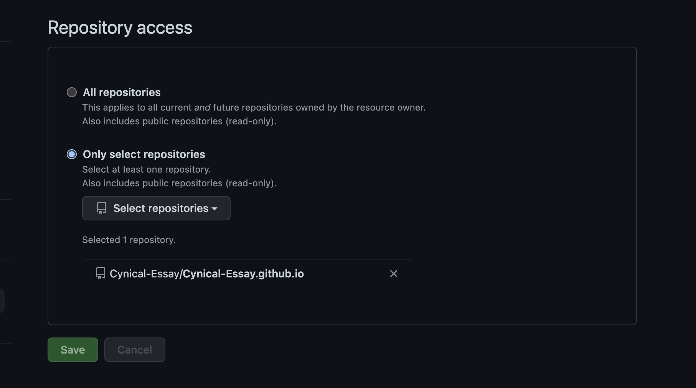
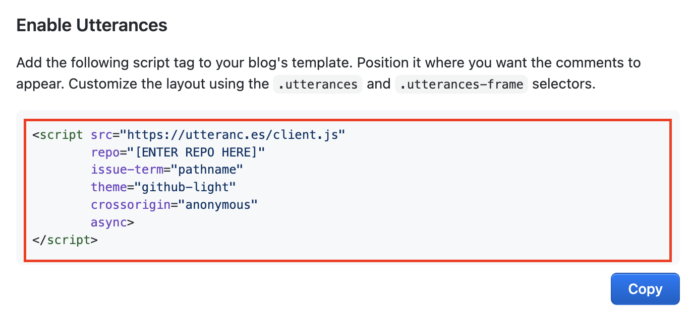
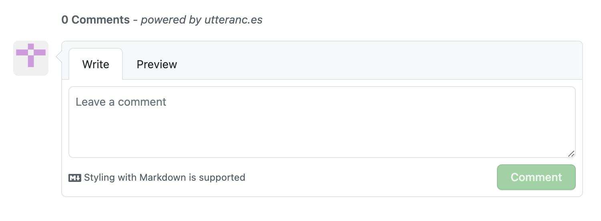
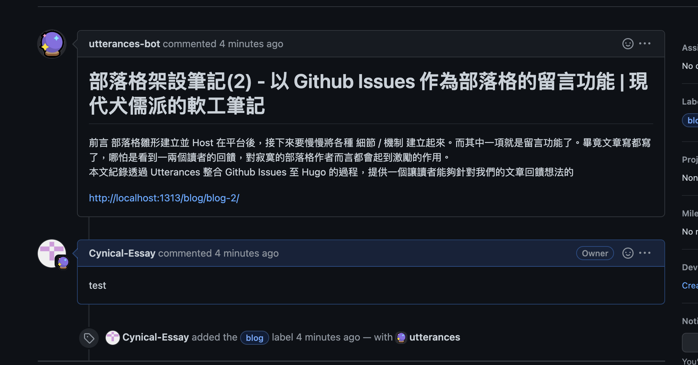

## 前言 ##

部落格雛形建立並 Host 在平台後，接下來要慢慢將各種 細節 / 機制 建立起來。而其中一項就是留言功能了。畢竟文章寫都寫了，哪怕是看到一兩個讀者的回饋，對寂寞的部落格作者而言都會起到激勵的作用。

本文紀錄透過 Utterances 整合 Github Issues 至 Hugo 的過程，提供一個讓讀者能夠針對我們的文章回饋想法的功能。

## 始於簡介 ##

### Comments Service With Hugo ###

Comments Service，留言服務，提供使用者對網站 or 網路社群留言的功能。
使用者可以使用如 Disqus / Facebook Comments 等服務提供商提供的現有服務，也可以透過 Isso 等留言服務開源專案自行 Host。自行 Host 的特性是資訊不會存在第三方的服務內，可控性較高，
缺點則是需要付出 架設 / 維運 的成本，使用現有服務則反之，如何選擇就依據各自使用的情境來評估了。

Hugo 預設支援 Disqus 留言服務，整合上也不困難。另外官網上的介紹也條列了許多[替代方案](https://gohugo.io/content-management/comments/#alternatives)。 

### Github Issues ###

大多數的軟工人員應該都不陌生，就是 Github 上提供針對專案 需求 / 異常 / 問題 的 Tracking 機制，支援 Markdown 語法。

### Utterances ###

以 Typescript 撰寫的開源留言服務工具。透過整合 Github Issues API 與 Github OAUTH，達到讓使用者可以針對如部落格或 WIKI 內容留言的功能。其留言的內容會被以 Issue 的形式存放在 Github 內。  

### 評估 ###
    
最後選用透過 Utterances 整合 Github Issues 作為部落格留言功能的理由有以下幾個：

1. 與使用開源套件 Self-hosted 留言服務相比，導入流程相對單純，維護成本低。
2. 目前部落格的版控 / Host 皆透過 Github 與其延伸應用 (Github Pages) 完成，若沒有特殊理由，習慣上還是想盡可能整合在同一個平台上。
3. 現階段對部落格的定位為軟工為主的學習心得紀錄，主要受眾大多都有技術背景，應該也都有個 Github 帳號，本機制雖無法提供匿名留言功能，但預期影響不大。
4. Github 有提供 [Issues Api](https://docs.github.com/en/rest/issues)，未來如果有服務移轉的需求，各方意見不至於帶不走。
5. 留言支援 Markdown 語法。

## 終於導入 ##

評估完畢，接著就來實作導入。

### 於指定 Repo 安裝 Utterances APP ###
 
* 建立一個 Github Public Repository 用以 儲存 / 讀取 留言的內容。這邊直接使用 Hugo 專案的 Repo ，不額外建立。

* 登入 Github 帳號，並 [安裝 Utterances](https://github.com/apps/utterances)，基本上只需讓其能夠存取指定的 Repo 即可。



### 設定，產出 Script ###

接著，透過 [Utterances 官網](https://utteranc.es) 進行設定，產出需鑲嵌至部落格內的 Script：

 * **Repository** : 就 Repo 的 Url 中，去掉 `https://github.com/` 的部分。
 
 * **Blog Post ↔️ Issue Mapping** : 文章與留言的映射，也會決定新增留言時 Github Issues 上的標題。日後部落格的編輯 / 搬移可能會因此設定而造成留言的異常。基本上可以想成是資料庫的外鍵。之所以選擇用 Title 作為映射，純粹是以 Issue 標題的可讀性做考量。

 * **Issue Label** : 即對方留言後，在 Github Issues 上要加註什麼標籤，非必填。

 * **Theme** : 留言區塊的主題，目前只能擇其一，沒辦法針對部落格複數主題的映射。

 填完之後就可以看到產生的 Script，把他複製起來。



### 鑲嵌至 Hugo 專案內 ###

這部分必須根據 Hugo 專案所選用的主題來處理，本專案使用的主題是 PaperMod，根據 [文件](https://github.com/adityatelange/hugo-PaperMod/wiki/Features#comments) 的描述：

* 在專案的 `layouts/partials` 路徑下，建立名為 `comments.html` 的檔案。

```
#專案根目錄
mkdir -p layouts/partials

touch layouts/partials/comments.html
```

* 複製貼上於 Utterances 產生的 Script。

* 編輯 Hugo 專案的 Config

```
# config.yaml
params:
    comments: true
```


### 本機驗證 ###

一樣透過 `Hugo Server -D` 將站台於本機 Run 起來，正確的話在文章的最下方會多了留言的區塊。



除了在部落格該文章內，也可以在 Github Issues 看到留言的內容。因為之前設定透過文章標題作為映射，因此會以文章的標題作為
Issues 的標題。



反向來說，我們在 Github Issues 上也是可以對留言進行回覆。

大致上就是這樣。