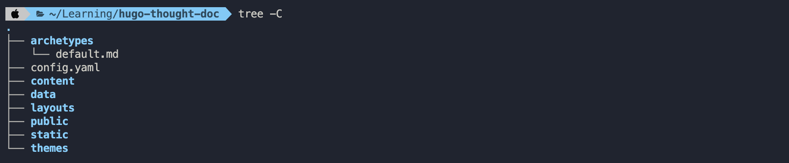
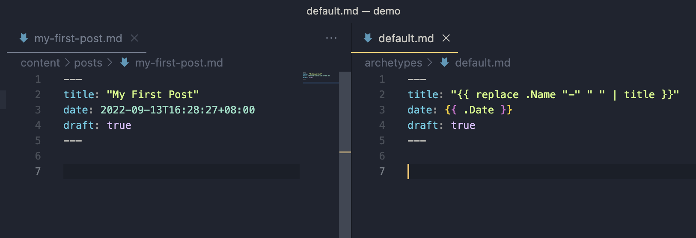
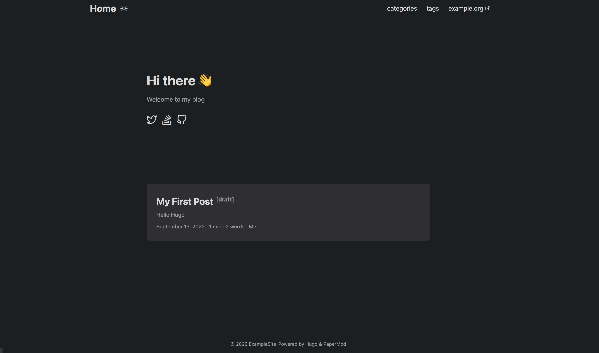
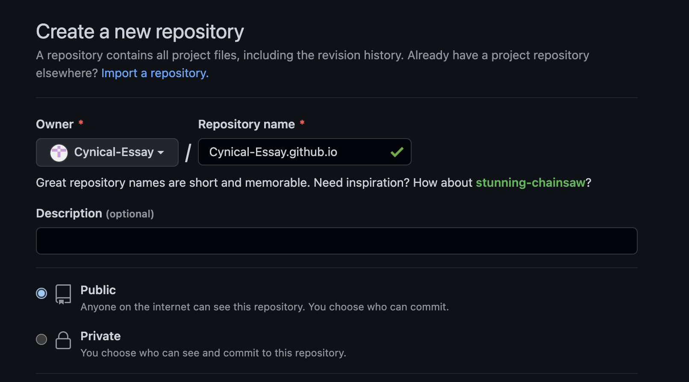
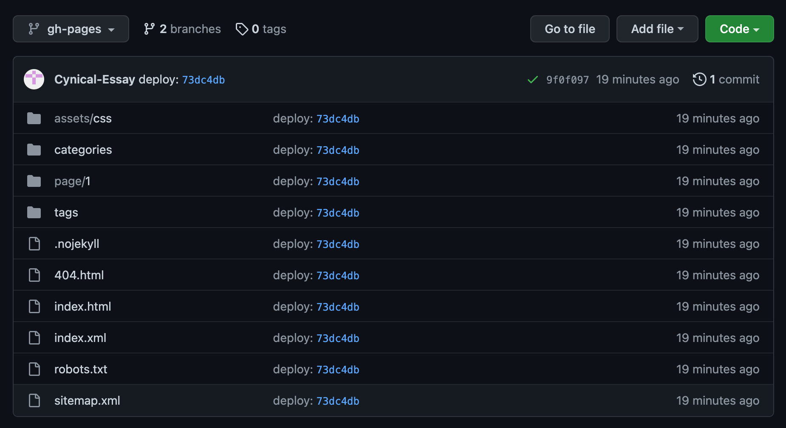

## 前言 ##

透過部落格學習新技術與紀錄生活，一直是個不錯的選擇。  

近期無意中發現除了過往使用如 Blogger / Medium / WP 等部落格平台服務外，也可以選擇透過 **靜態網站生成框架** 來撰寫部落格。

好奇心加上以往的部落格往往寫不到幾篇就放著長草，想要一雪前恥。於是有點遞迴的，這個部落格的誕生，就從一篇如何透過 **靜態網站生成框架** 架設本部落格的文章作為起點。

## Hugo 簡介 ##

根據官網所述，Hugo 是一個靜態網站生成器 (Static Site Generator)。  

直白點說，就是配合其規則，把想要的內容，用指定的語法撰寫後，放到指定的檔案路徑下，透過 CLI 指令即可產生靜態網站的產出物，至於如路由之類的底層操作則交由框架來負責，使用者就不用費心了。

這類生成器種類其實挺不少的，無論是以 Node.js 開發的 Hexo ，或是以 Gloang 開發的 Hugo 等，生態圈都相當完整，也都有一定的使用者。  

之所以會選擇 Hugo，單純是基於一個架設部落格的新手而言，與其花大量時間在研究這些差不多優秀的框架的細節，不如就擇一開始研究與實作，~~何況身為一個軟體工程師，應該可能八成大概也沒有什麼事情是解決不了的吧。~~  

> 樂觀主義是民族的鴉片  
>
> -米蘭．昆德拉
{.common-quote-class}

## 始於本機 ##

### 環境安裝 ###

MacOS 作業系統的使用者，配合 Homebrew 套件管理工具，安裝上就跟多數套件的安裝大同小異。

```
brew install hugo
```

一行，打完收工。

然後也跟大多數套件的安裝一樣，來確認一下版本號。

```
hugo version
```

就這樣，清楚明白，簡單粗暴，讚。

### 建立專案 ###

接著建立 Hugo 專案。  

Hugo 的 Config 檔預設為 Toml 格式，另外也支援 Yaml/Json 格式，建立專案時可透過 **-f** 來指定格式。

```
hugo new site blog-hugo-cynical-essay -f yaml
```

可以看一下到底長了什麼出來

```
cd blog-hugo-cynical-essay
tree -C
```
結果如圖



初始的專案結構非常單純，除了一些資料夾路徑外，還有：
1. 位於根目錄的 `config.yaml` ，毫無疑問就是該靜態網站的組態檔。
2. 位於 `archeypes` 路徑下的 `default.md` ，其作用為內容的樣板。  
當我們要開始寫一篇文章，可以透過 `hugo new [path]` 產生 Markdown 檔案，該檔案就會依照 `default.md` 檔描述的樣板產生預設的資訊。

### 選擇主題 ###

再來要選擇一個主題。  

當然我們也可以自行撰寫設計主題，但是現階段還是以熟悉與了解框架為主。

稍微列一下主題的挑選與使用上的心得：
1. 官網很貼心的把主題做了分類，使用者可以根據自身需求挑選適合的主題 (LandingPage / Blog / RWD .etc)。
2. 多數的主題都有提供 Demo site，除了官網的圖示外，也可以用不同的裝置去 Demo site 實際操作看看是否符合預期。 
3. 主題通常會伴隨有自身的組態設定，這時候文件就變得蠻重要的，除了主題的適用性外，文件的完整度也可納入是否使用的評估範圍內。

這次選用 [PaperMod](https://github.com/adityatelange/hugo-PaperMod) 作為部落格的主題。根據文件描述，我們透過將主題的 Repo 加入 Git Submodules 
清單內來導入該主題，首先在 Hugo 專案的根目錄進行 Git Repo 的初始化：

```
# 專案根目錄
git init -b main
```

接著將主題專案的 Repo 加入 Git Submodules 內：

```
git submodule add --depth=1 https://github.com/adityatelange/hugo-PaperMod.git themes/PaperMod
```

可以看到根目錄增加包含以下資訊的 .gitmodules 檔：

```
[submodule "themes/PaperMod"]
  path = themes/PaperMod
  url = https://github.com/adityatelange/hugo-PaperMod.git
```

`themes/PaperMod` 路徑下也長出了 PaperMod 主題的相關檔案路徑與檔案，當然這些資源不會列在版控內。  

最後，[PaperMod 的官方文件](https://github.com/adityatelange/hugo-PaperMod/wiki/Installation#sample-configyml) 內有提供預設的 config 內容，可以先複製貼上。
接著稍微留意一下 Config 檔內有個名稱為 `theme` 的 Key 值

```
theme: PaperMod
```

到這裡就可以聯想到，Hugo 相關的主題都會放在 `themes/` 路徑下，彼此之間用主題名稱做區隔，再透過 Config 設定來決定欲使用的主題。  

最後在本機把站台 on 起來。

```
hugo server
```


於是網站的雛形就建立起來了。

### 來篇文章 ###

緊接著當然就是要來建立第一篇文章了。  
Hugo 框架下相關的內容，都會在 `content/` 路徑下作延伸，我們先產生一篇文章出來。

```
hugo new posts/my-first-post.md
```

可以看到在 `content/posts` 路徑下，生成了一個名叫 `my-first-post.md` 的檔案，該檔案依據 `archetypes/default.md` 的樣板資訊，產生了預設的內容 (一些 Front Matter，可以先想成是該檔案的 metadata)。



上圖可以看出，目前該檔案是被設定成草稿狀態 (Draft:true)，前述的 `hugo server` 指令會忽略草稿狀態的檔案，因此我們必須要多下一個 **-D**  才行，另外執行 `hugo` 指令時，草稿也會被忽略。

```
hugo server -D
```



文章長出來了，就是這麼簡單。

## 終於 GitHub Pages ##

### 部署至平台 ###

既然已經能夠寫文章了，下一步就是想辦法部署到平台上，這樣一來才能讓各路人馬品頭論足批評指教。

Hugo 的 [官方文件](https://gohugo.io/hosting-and-deployment/) 針對部署到各平台提供了種類完整且詳盡的說明。由於本部落格是透過 Github 來進行版本控管，自然選用了 Github Page 作為部落格的 Host。我們只負責產出文章，
讓 Github 當作讓本部落格能夠被看見的那條龍。

> 「你就是那條龍。」
>
> -什麼都得幹的軟工哈士奇悲歌
{.common-quote-class}

### GitHub Page 簡介 ###

大多數的軟體工程師，應該不至於沒聽過 Github 的大名吧。GitHub Page 可以算是該服務的延伸應用。使用者進行一次性設定，將靜態網站的產出物上傳至 Repo，之後就透過提交異動來對網站進行更新，非常方便。

### 跟著文件做 ###

看過 [文件](https://gohugo.io/hosting-and-deployment/hosting-on-github/) 後，用一張圖來解釋其網站內容更新機制的話，大約是這樣： 


* **STEP 1:**  網站作者在本機修改網站內容，並將異動上傳至 **main** 分支。
* **STEP 2:**  上傳至 **main** 分支的事件會觸發 Github Action，Runner 會 clone **main** 分支的內容，對其執行`hugo --minify`指令產生靜態網站產出物，並將其上傳至 **gh-pages** 分支。  
  
大致了解，那就一步步將該設定、該建立的處理起來：

1. 建立一個名為 `{User Name}.github.io` 的 Repository，因為我是 Github 免費仔，所以記得要設定成 **Public**。


2. 設定 GitHub Action 需要的相關設定。

```
# 專案根目錄
mkdir -p .github/workflows
touch .github/workflows/gh-pages.yml

# 參考下方連結，複製貼上到 gh-pages.yml 檔內
# https://gohugo.io/hosting-and-deployment/hosting-on-github/#build-hugo-with-github-action 
```

3. 設定 Remote Repo。

```
# 專案的根目錄
git remote add origin {repo url}
git fetch origin
```

4. 將異動上傳至 Remote Branch 。

```
git add --all
git commit -m "init hugo site"
git push --set-upstream origin main
```

接著可以在 Repository 的 Actions 頁籤確認是否有正常觸發 Github Action。


既然 Github Action 看起來正常，那 **gh-pages** 分支內，應該會有靜態網站的產出物，趕緊來瞄一眼。



果然如此，真是神機妙算啊!!

5. 最後到 Repository 下 Setting 頁籤左側的 Pages，設定 **gh-pages** Repo 為網站產出物，完成最後一哩路。


接著讓子彈飛一下，大約一兩分鐘內設定就會生效了。

於是第一篇文章兼部落格架設，就這樣誕生了，可喜可賀。  